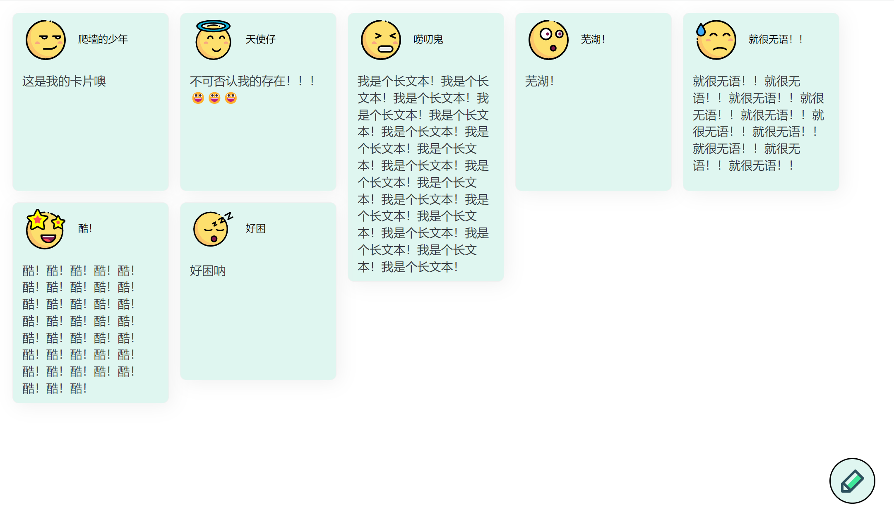

# miniWall
miniWall

# 效果图

# 使用
  * 因为swiper组件版本问题目前可能使用存在问题(发布卡片头像选择样式有问题，有空再修复)
  * git clone https://github.com/TTTJH/miniWall.git
  * cd miniWall
  * npm install
  * 开启mongodb
  * 访问：localhost:3000
